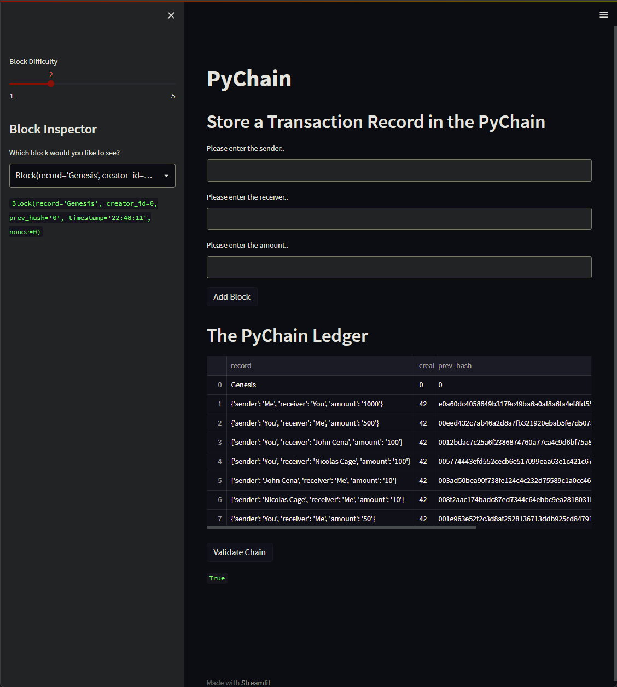
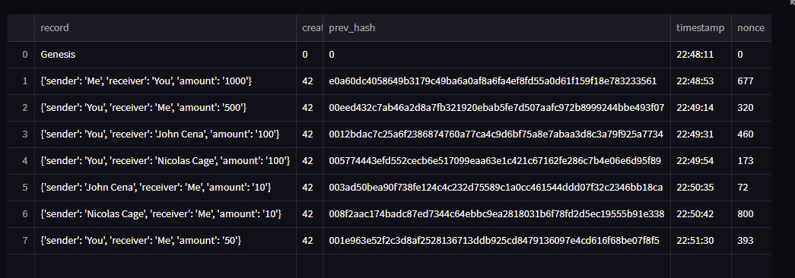

# PyChain Ledger

You’re a fintech engineer who’s working at one of the five largest banks in the world. You were recently promoted to act as the lead developer on their decentralized finance team. Your task is to build a blockchain-based ledger system, complete with a user-friendly web interface. This ledger should allow partner banks to conduct financial transactions (that is, to transfer money between senders and receivers) and to verify the integrity of the data in the ledger.

You’ll make the following updates to the provided Python file for this assignment, which already contains the basic `PyChain` ledger structure that you created throughout the module:

1. Create a new data class named `Record`. This class will serve as the blueprint for the financial transaction records that the blocks of the ledger will store.

2. Modify the existing `Block` data class to store `Record` data.

3. Add Relevant User Inputs to the Streamlit interface.

4. Test the PyChain Ledger by Storing Records.

## Process

1. Create a Record Data Class

2. Modify the Existing Block Data Class to Store Record Data

3. Add Relevant User Inputs to the Streamlit Interface

4. Test the PyChain Ledger by Storing Records

### Step 1: Create a Record Data Class

1. Define a new class named `Record`.

2. Add the `@dataclass` decorator immediately before the `Record` class definition.

3. Add an attribute named `sender` of type `str`.

4. Add an attribute named `receiver` of type `str`.

5. Add an attribute named `amount` of type `float`.

### Step 2: Modify the Existing Block Data Class to Store Record Data

1. In the `Block` class, rename the `data` attribute to `record`.

2. Set the data type of the `record` attribute to `Record`.

### Step 3: Add Relevant User Inputs to the Streamlit Interface

1. Delete the `input_data` variable from the Streamlit interface.

2. Add an input area where you can get a value for `sender` from the user.

3. Add an input area where you can get a value for `receiver` from the user.

4. Add an input area where you can get a value for `amount` from the user.

5. As part of the “Add Block” button functionality, update `new_block` so that `Block` consists of an attribute named `record`, which is set equal to a `Record` that contains the `sender`, `receiver`, and `amount` values. The updated `Block` should also include the attributes for `creator_id` and `prev_hash`.

### Step 4: Test the PyChain Ledger by Storing Records

Test your complete `PyChain` ledger and user interface by running your Streamlit application and storing some mined blocks in your `PyChain` ledger. Then test the blockchain validation process by using your `PyChain` ledger.

Example of the Blockchain interface

Example of the full Pychain ledger
